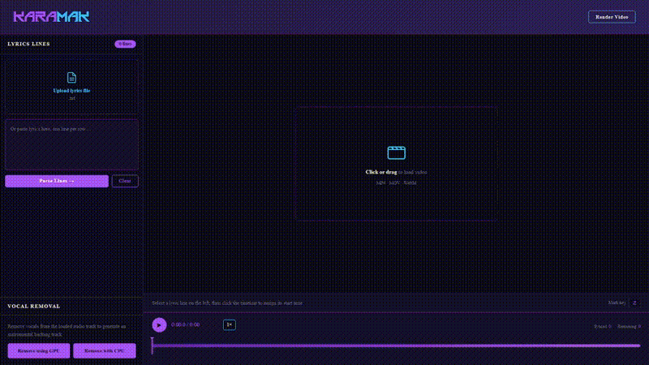
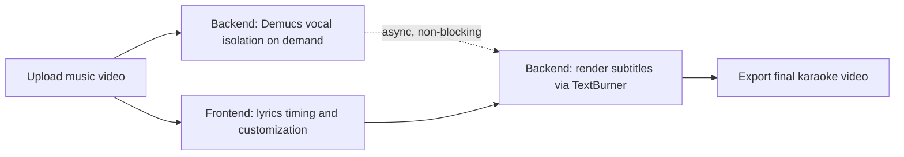

# 🎤 KaraMak

Turn any music video into a karaoke version: strip the vocals with 1 click, then add your own custom-timed and styled lyrics that render burned into the final video.

> Upload a video → AI removes the vocals → drop in your lyrics and set when each line appears → export a ready-to-sing karaoke video.


*Demonstration of karaoke making workflow. I used [LemON - Napraw](https://www.youtube.com/watch?v=9GQqF8Q7wQY) for a preview*

---

## ✨ Features

- **Automatic vocal removal** using the [Demucs](https://github.com/facebookresearch/demucs) source-separation model
- **Non-blocking processing** — vocal isolation runs asynchronously, so you can keep working (e.g. timing lyrics) while it processes
- **Custom lyric timing** — write your own lyrics and set exactly when each line should appear
- **Accurate text rendering** — subtitles are burned into the video at the backend using `ffmpeg` + `libass`, with the frontend preview scaled to match the same rendering engine as closely as possible, so what you see is almost identical to what you get
- **Web-based UI** for uploading, previewing, and timing — it's all in your browser

## 🧠 How it works



1. You upload a video containing a song.
2. You isolate vocals with Demucs **asynchronously** if you wish to do so — the UI stays responsive while it's running.
3. Meanwhile (or afterward), you write your lyrics and set the timestamp for each line in the web editor.
4. Once you're ready, the backend renders the lyrics as burned-in subtitles with TextBurner(uses `ffmpeg` & `libass`), where the web preview is using the same scale factors as the TextBurner so the final video matches what you saw in-browser as closely as possible.
5. You get a finished karaoke video with vocals removed and your lyrics synced on-screen.

## 🛠 Tech stack

- **Backend:** Python, Flask, Demucs(Hybrid Transformer Fine-Tuned), ffmpeg (using libass for subtitle rendering)
- **Frontend:** plain HTML/CSS/JS, I plan to migrate it to some framework later for scalability, but it does the job

## 🚧 Status

This project is a **work in progress**, but it absolutely works. Current focus is on the UI/UX & bugfixing, further text customization, plus an in-house vocal-removal model to eventually replace/complement Demucs.

Limitations:
- PC only for now
- Frontend rendering is a best-effort approximation of the backend's `ffmpeg`/`libass` output — minor visual differences between preview and final render are possible, but the difference should be about 2-3 pixels :)

## 🚀 Getting started

Requirements:
- Python 3.11+
- [ffmpeg](https://ffmpeg.org/) installed and available on your system `PATH`

Setup:

```bash
git clone https://github.com/Layrixi/Karaoke-Maker.git
cd Karaoke-Maker
pip install -r requirements.txt
python main.py
```
PS. You can also simply download the whole project instead of cloning the repo
Then open `http://127.0.0.1:5000` in your browser.
Still working on the installer. Goal is to make it a click-and-go app.

## 🗺 Roadmap

- [ ] Custom vocal-removal model (in progress)
- [ ] Installer
- [ ] Port adaptability
- [ ] 2 lyric lines appear at once
- [ ] UI/UX polishing
- [ ] Edge-cases investigation and bughunting
- [ ] Android version

## 📄 License

*MIT*
